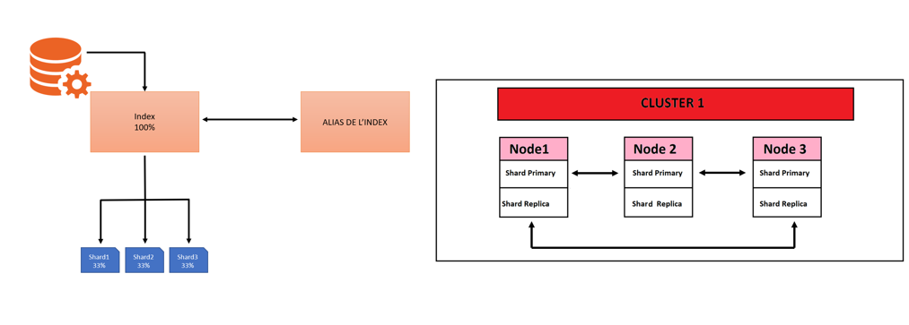

# Réponses du TP3

## Elaborez un schéma global qui permet de comprendre au mieux les concepts suivants avec Elasticsearch

- Schéma :
</img>

## Comment Elasticsearch stocke ses données et comment certaines de ces notions permettent de gagner en robustesse (en termes de sauvegarde et d’intégrité des données). Terminez en résumant les fonctionnalités de mise à l’échelle

- Elasticsearch est naturellement distribué. Les documents stockés dans Elasticsearch sont distribués dans différents conteneurs appelés partitions, qui sont dupliqués pour intégrer des copies doublées des données en cas de défaillance matérielle. La nature distribuée d'Elasticsearch lui permet de scaler des centaines (voire même des milliers) de serveurs et gérer des pétaoctets de données.

## D’après vos recherches pourquoi l’utiliser ? Est-ce le bon paramètre de recherche pour effectuer de la recherche paginée ?

- Le scroll est une fonctionnalité qui permet de récupérer un grand nombre de résultats (ou tous les résultats) d'une requête, de manière efficace, et ce de manière itérative. Le scroll est une fonctionnalité qui permet de récupérer un grand nombre de résultats (ou tous les résultats) d'une requête, de manière efficace, et ce de manière itérative. Et c'est pourqoui il est bon de l'utiliser. C'est le bon paramètre de recherche pour effectuer de la recherche paginée du à son efficacité.

## Quel est l’usage principal de Kibana ?

- Kibana est une interface web qui permet de visualiser les données stockées dans Elasticsearch. Il permet de créer des tableaux de bord et des graphiques à partir des données stockées dans Elasticsearch.

## Qu'est ce qu'un Dashboard ?

- Un dashboard est une interface utilisateur qui permet d'organiser et de visualiser des informations sous forme de graphiques, de tableaux, de métriques et bien plus encore. Les dashboards peuvent être personnalisés pour répondre aux besoins spécifiques de chaque utilisateur.